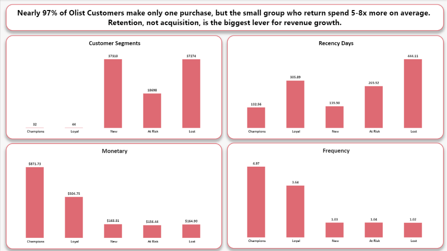
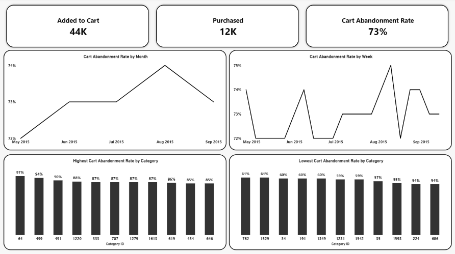
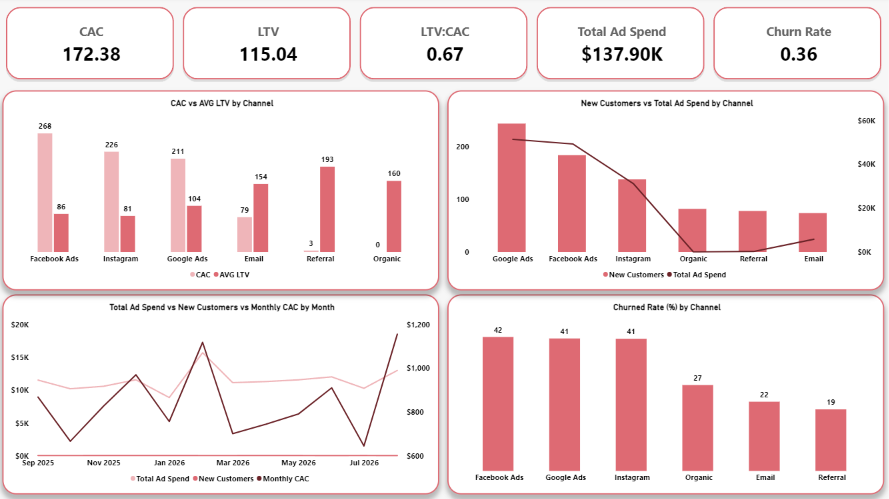
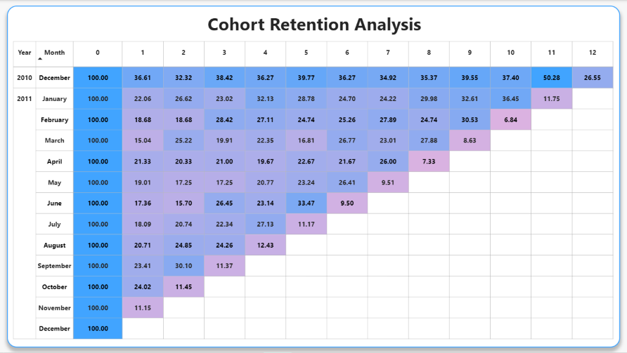
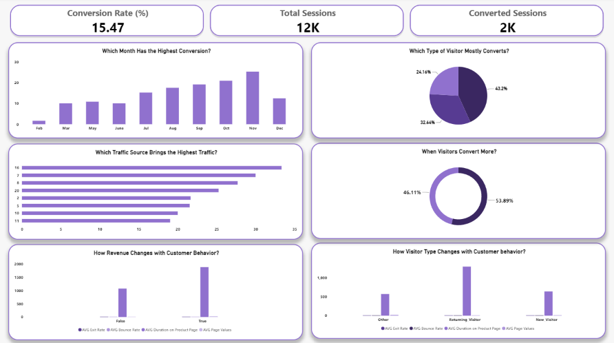
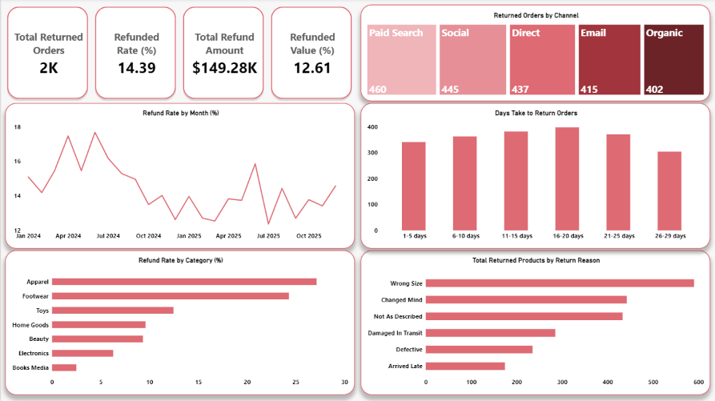

## About Me

I'm a **Data & Insights Analyst** based in Dhaka, Bangladesh, focused on **B2C e-commerce** — turning raw transaction, clickstream, and marketing data into decisions a stakeholder can actually act on. Each project below follows the same structure: Background, Data, Executive Summary, Deep-Dive Insights, and Recommendations — built with SQL (DuckDB), Excel, and Power BI.

**Tools:**

---

## Featured Projects

### 1. Customer Segmentation & Spend Analysis
*Olist Brazilian E-Commerce dataset — ~96,000 orders, ~93,000 customers*

RFM segmentation combined with AOV, GMV, retention, and CSAT analysis in one connected story. Found that only **3% of customers ever place a second order**, and that satisfaction (4.09/5 average) collapses sharply — not gradually — the moment a delivery runs late.

**[View case study →](https://github.com/Ramia-Ahmed/Customer-Segmentation-and-Spend-Analysis)**

---

### 2. Cart Abandonment Funnel Analysis
*Retail Rocket clickstream dataset — 2.7M+ raw events*

Built session and funnel logic from scratch on raw event data to measure cart abandonment. Overall rate (72.8%) is in line with industry norms and flat over time — but abandonment by product category ranges from **47% to 97%**, the strongest lever in the data.

**[View case study →](https://github.com/Ramia-Ahmed/Cart-Abandonment-Funnel-Analysis)**

---

### 3. CAC & LTV Ratio Analysis
*Synthetic marketing dataset — 6 channels, 12-month window*

Compared acquisition cost against customer lifetime value by channel. Blended LTV:CAC sits at **0.67** — the business spends more acquiring customers than they're worth on average — driven almost entirely by paid channels acquiring at a loss while churning customers twice as fast as organic/email/referral.

**[View case study →](https://github.com/Ramia-Ahmed/CAC-and-LTV-Ratio-Analysis)**

---

### 4. RFM Segmentation & Cohort Retention Analysis
*UCI "Online Retail" dataset — ~540,000 invoice line items*

Paired RFM segmentation with month-over-month cohort retention. **265 "Champion" customers generate $5.7M** — more than every other segment combined — and retention drops off a cliff after month 1 but stabilizes into a distinct "core repeat" base afterward.

**[View case study →](https://github.com/Ramia-Ahmed/RFM-Segmentation-and-Cohort-Retention-Analysis)**

---

### 5. Conversion Rate Analysis
*UCI "Online Shoppers Purchasing Intention" dataset — 12,330 sessions*

Analyzed which visitor types, timing, and on-site behaviors predict purchase. Overall conversion is **15.47%**, more than doubling from a February low to a November peak — and on-site engagement (page values, exit rate) separates converters from non-converters far more sharply than any demographic split.

**[View case study →](https://github.com/Ramia-Ahmed/Conversion-Rate-Analysis)**

---

### 6. ROAS & ROI Analysis
*Synthetic marketing dataset — 6 channels, 15 campaigns*

Evaluated marketing return across channels and campaigns. Overall spend is profitable (**2.89 ROAS, 189% ROI**), but channel performance varies more than 4x — and the gap comes down to acquisition cost, not funnel quality, since click-through and conversion rates are nearly identical across every channel.

**[View case study →](https://github.com/Ramia-Ahmed/ROAS-ROI-Analysis)**

---

### 7. Refund Rate Analysis
*Synthetic retail dataset — 15,000 orders, 2,159 returns*

Investigated what drives product returns for a mid-sized retailer. Overall refund rate is **14.39% by order count**, but category tells the whole story: refund rate ranges from **27% (apparel) down to 2.5% (books & media)** — an 11x spread — while channel and time period show almost no variation.

**[View case study →](https://github.com/Ramia-Ahmed/Refund-Rate-Analysis)**

---

## Currently Learning
Statistics for analytics

## Let's Connect
[LinkedIn](https://www.linkedin.com/in/ramiaahmed/) · [GitHub](https://github.com/Ramia-Ahmed) · Open to remote Data & Insights Analyst opportunities
